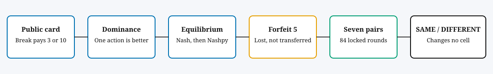
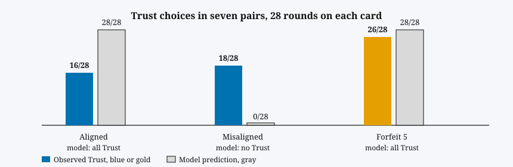

<div align="center">

# Trust the Table, Not the Resemblance

## A public forfeit on the card, not the similarity label

**COMSCI/ECON 206 · Computational Microeconomics**  
Duke Kunshan University · Autumn 2026  
**FP12 · Muhan Chen**

*On a misaligned card, a forfeit of 5 makes Trust, Keep the unique equilibrium. A SAME/DIFFERENT label changes no cell. Seven pairs did not follow that Keep prediction.*

<p>
  <a href="paper/compiled/PS2-FP12-Muhan-Chen.pdf"></a>
  <a href="poster/PS2-FP12-TrustForfeit-A0.pdf"></a>
  <a href="https://colab.research.google.com/github/dku-comsci-econ206-Autumn2026/PS2-FP12-Muhan-Chen/blob/main/PS2_trust_forfeit.ipynb"></a>
  <a href="https://huggingface.co/spaces/dku-comsci-econ206-2026/Trust_Forfeit"></a>
</p>
<p>
  <a href="hf_static/index.html"></a>
  <a href="data/README.md"></a>
  <a href="#reproduce"></a>
  
</p>

<sub>The test badge records the last local check of this snapshot. It is not a live CI badge. The paper PDF is the exported article; the poster PDF is the exported A0 sheet.</sub>

</div>

> [!IMPORTANT]
> **Misaligned card · forfeit of 5 · equilibrium: Trust, Keep**  
> Payoffs: **6 and 6** · Without the forfeit: **Verify, Break**, payoffs **2 and 10**  
> Classroom Trust on the forfeit card: **26/28** · Keep on that card: **15/28**

## Project pipeline

<p align="center">
  
</p>

The project writes the promise as a two-player game, checks the equilibria in code, and then asks whether two classmates follow the card or the SAME/DIFFERENT label. The label is on screen. It is not in the payoff.

## Game at a glance

| Element | Definition |
|---|---|
| Players | Promiser, Decider |
| Promiser actions | Keep / Break |
| Decider actions | Trust / Verify, without seeing the Promiser's choice |
| Public card | Aligned (Break pays 3) or misaligned (Break pays 10) |
| Intervention | Forfeit of 5 on a misaligned Break, lost by the Promiser |
| Label | SAME / DIFFERENT. It changes no cell and cannot waive the forfeit |
| Solution concept | Unique pure-strategy Nash equilibrium |
| Check | One-shot deviations, then Nashpy support enumeration |
| Classroom record | Seven pairs, session code 206, 84 rounds with both choices locked |

| Action | What it pays |
|---|---|
| **Trust and Keep** | Decider 6, Promiser 6 |
| **Trust and Break** | Decider −4; Promiser 3, 10, or 5, depending on the card and the forfeit |
| **Verify** | Decider 2, whether the Promiser keeps or breaks |

> [!CAUTION]
> **The forfeit is not paid to the Decider.** On the Trust-and-Keep path it is not paid at all. SAME/DIFFERENT cannot cancel it.

## Three equilibria

<p align="center">
  
</p>

Rows are Trust, Verify. Columns are Keep, Break. Each cell is (Decider, Promiser).

Aligned, no forfeit. Equilibrium: Trust, Keep.

| | Keep | Break |
|---|---:|---:|
| Trust | 6, 6 | −4, 3 |
| Verify | 2, 6 | 2, 3 |

Misaligned, no forfeit. Equilibrium: Verify, Break.

| | Keep | Break |
|---|---:|---:|
| Trust | 6, 6 | −4, 10 |
| Verify | 2, 6 | 2, 10 |

Misaligned, forfeit 5. Equilibrium: Trust, Keep.

| | Keep | Break |
|---|---:|---:|
| Trust | 6, 6 | −4, 5 |
| Verify | 2, 6 | 2, 5 |

The 60 percent benchmark is the PS1 threshold: `10p − 4 = 2`, so `p* = 0.6`. It is the point at which Trust matches Verify when Keep is still a probability. In this game one action is strictly better, so the equilibrium does not use that probability.

## Classroom play

<p align="center">
  
</p>

| Card | Model | Observed |
|---|---|---|
| Aligned | Trust 1, Keep 1 | Trust 16/28; Keep 14/28 |
| Misaligned, no forfeit | Trust 0, Break 1 | Trust 18/28; Break 13/28 |
| Misaligned, forfeit 5 | Trust 1, Keep 1 | Trust 26/28; Keep 15/28 |

Trust did not separate the aligned card from the misaligned card without a forfeit. The rise from 18/28 to 26/28 when the forfeit appeared is descriptive, and those cards are rounds 5, 7, 11, and 12, so the rise is mixed with order. Keep stayed near one half on every card. SAME Trust was 28/42, below DIFFERENT Trust at 32/42. The files are [`data/session-01.csv`](data/session-01.csv) through [`data/session-07.csv`](data/session-07.csv).

> [!NOTE]
> These seven pairs are a course exercise on one computer. They are not a sample of negotiators. The Space stores no accounts. Interface clicks are not these sessions. `outputs/results.json` still records `human_n: 0` because the solver does not read the CSV files.

## Auction note, not the result

`forfeit_auction` records a two-bid contest for the course appendix. The higher integer bid becomes the Promiser. The forfeit written on the misaligned Break cell is the second bid. Similarity cannot change a bid or break a tie. A second bid above 4 makes Keep strictly better. A second bid below 4 makes Break strictly better. A second bid of exactly 4 leaves the Promiser indifferent. A Promiser who Keeps does not pay the forfeit, so the function does not claim that bidding one's cost is dominant.

## Reproduce

| Check | Result |
|---|---|
| `p*` | 0.6 |
| Aligned equilibrium | Trust, Keep, payoffs 6 and 6 |
| Misaligned, no forfeit | Verify, Break, payoffs 2 and 10 |
| Misaligned, forfeit 5 | Trust, Keep, payoffs 6 and 6 |
| PS1 seed 206, copied schedule | benchmark +48, always-Verify +24, always-Trust +22, Trust-if-similar +18 |
| Unit tests | 12, including JavaScript agreement with [`hf_static/verify_logic.js`](hf_static/verify_logic.js) |

From a fresh clone:

```bash
git clone https://github.com/dku-comsci-econ206-Autumn2026/PS2-FP12-Muhan-Chen.git
cd PS2-FP12-Muhan-Chen
python3 -m venv .venv
source .venv/bin/activate
python -m pip install -r requirements.txt
python trust_forfeit.py
python -m unittest discover -s tests -v
node hf_static/verify_logic.js
```

`trust_forfeit.py` writes `outputs/results.json`.

**Colab.** Open [`PS2_trust_forfeit.ipynb`](https://colab.research.google.com/github/dku-comsci-econ206-Autumn2026/PS2-FP12-Muhan-Chen/blob/main/PS2_trust_forfeit.ipynb) and choose Runtime → Run all. The first code cells install Nashpy and write `trust_forfeit.py`.

**Game.** Two people pass one computer at the [Hugging Face Space](https://huggingface.co/spaces/dku-comsci-econ206-2026/Trust_Forfeit). The same page is stored in [`hf_static/`](hf_static/index.html).

## Repository map

```text
trust_forfeit.py                 matrices, Nashpy check, seed 206, auction record
PS2_trust_forfeit.ipynb          Colab notebook with saved output
tests/                           12 checks, including JavaScript parity
hf_static/                       static two-player game, also deployed on Hugging Face
data/                            seven classroom sessions, 84 locked rounds
outputs/results.json             saved solver run; it does not read data/
paper/                           article source and exported PDF
poster/                          exported A0 poster
docs/assets/readme/              figures on this page
tools/build_notebook.py          rebuilds the notebook from trust_forfeit.py
```

## Limits

The Promiser's Keep and Break payoffs do not depend on whether the Decider trusted. Twelve rounds deal a fresh card and do not carry points into the next card. This is not a reputation model. The two equilibria have the same total, 12; the forfeit changes who receives it. If the Break payoff exceeds 11, or the forfeit is not collected, the flip does not follow.

The article source title is “Trust the Card, Not the Resemblance.” This repository and the Space use “Trust the Table, Not the Resemblance.”

## Selected references

- Nash, J. F. (1950). “Equilibrium Points in n-Person Games.” *Proceedings of the National Academy of Sciences*. [DOI](https://doi.org/10.1073/pnas.36.1.48)
- Berg, J., Dickhaut, J., and McCabe, K. (1995). “Trust, Reciprocity, and Social History.” *Games and Economic Behavior*.
- Crawford, V. P., and Sobel, J. (1982). “Strategic Information Transmission.” *Econometrica*. [DOI](https://doi.org/10.2307/1913390)
- DeBruine, L. M. (2002). “Facial Resemblance Enhances Trust.” *Proceedings of the Royal Society B*. [DOI](https://doi.org/10.1098/rspb.2002.2034)
- Vickrey, W. (1961). “Counterspeculation, Auctions, and Competitive Sealed Tenders.” *Journal of Finance*. [DOI](https://doi.org/10.1111/j.1540-6261.1961.tb02789.x)
- Osborne, M. J., and Rubinstein, A. (1994). *A Course in Game Theory*. MIT Press.

| Course | Team | Author | Instructor | Term |
|---|---|---|---|---|
| COMSCI/ECON 206 · Computational Microeconomics | FP12 | Muhan Chen | Professor Luyao Zhang | Autumn 2026 |

---

<p align="center"><sub>Figures on this page are drawn from the matrices and from the seven session files. They are not a forecast about negotiators outside this exercise.</sub></p>
